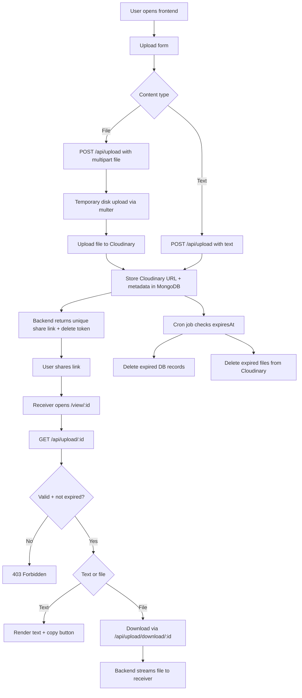

# LinkVault Data Flow Diagram

```mermaid
flowchart TD
    A[User opens frontend] --> B[Upload form]
    B --> C{Content type}
    C -->|Text| D[POST /api/upload with text]
    C -->|File| E[POST /api/upload with multipart file]
    E --> F[Temporary disk upload via multer]
    F --> G[Upload file to Cloudinary]
    G --> H[Store Cloudinary URL + metadata in MongoDB]
    D --> H
    H --> I[Backend returns unique share link + delete token]
    I --> J[User shares link]
    J --> K[Receiver opens /view/:id]
    K --> L[GET /api/upload/:id]
    L --> M{Valid + not expired?}
    M -->|No| N[403 Forbidden]
    M -->|Yes| O{Text or file}
    O -->|Text| P[Render text + copy button]
    O -->|File| Q[Download via /api/upload/download/:id]
    Q --> R[Backend streams file to receiver]
    H --> S[Cron job checks expiresAt]
    S --> T[Delete expired DB records]
    S --> U[Delete expired files from Cloudinary]
```

